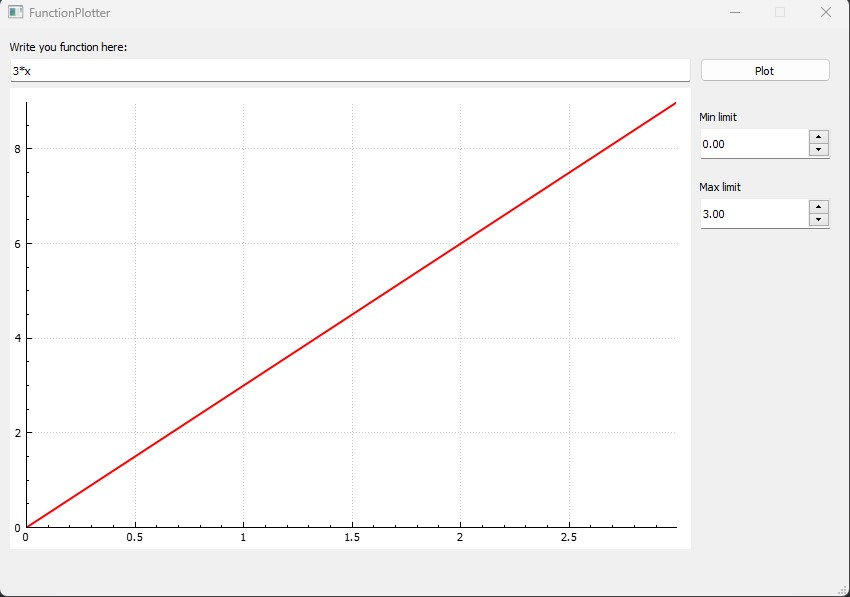
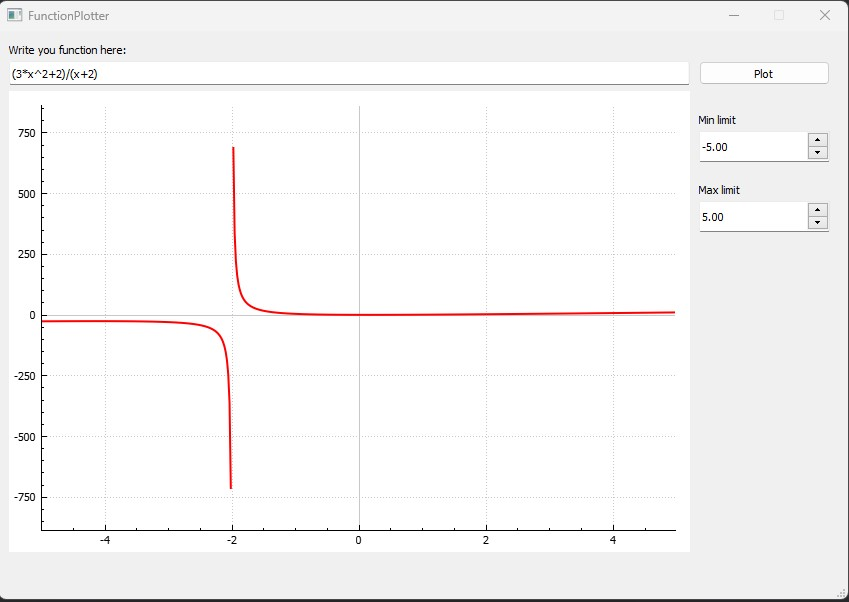
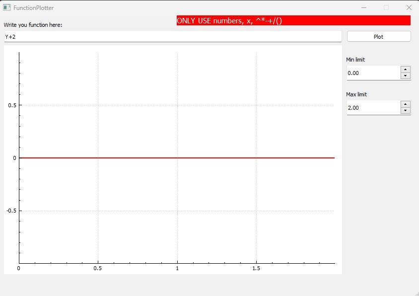
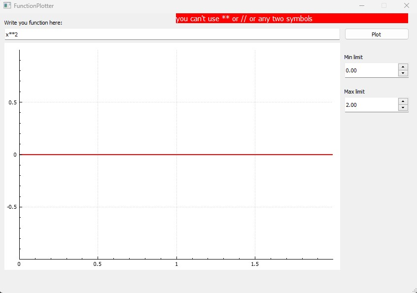
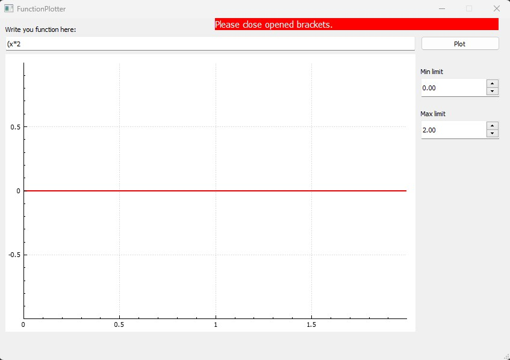
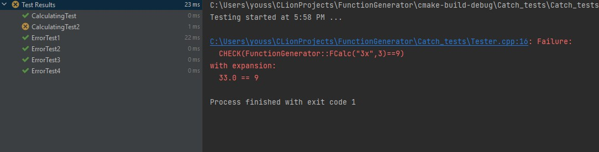

# Function_Plotter
this app is a function plotter using **Qt** with **c++**, with simple user interface.

### File Structure:

this app made using Qt so the files would be in its shape,

```
FunctionPlotter
|_ FunctionPlotter.pro
|_ FunctionGenerator.h
	|_FunctionGenerator.cpp
|_MainWindow.h
	|_MainWindow.cpp
|_main.cpp
```

### Screenshots:

1- how the application already work:



2- some challenging example



3- trying some handled error cases1







### Automatic Testing:

while using qt, I get some troubles while running automatic test, so instead of that I tried to run the test in a another file, with the core class which is `FunctionGenerator.h`, and this is the results of the test



the test failed only in a case when `3x`, in mathematics, this will result 9, but the program has some trouble when dealing that case.
